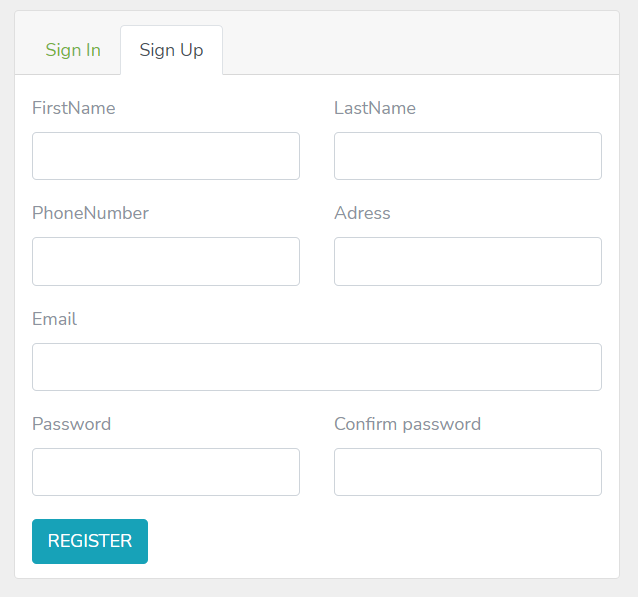

# E-Commerce
E-Commerce application written in ASP.NET Core 3.1 MVC and MSSQL.

## Architecture
This application is created using ASP.NET Core 3.1 Web Application  
*Languages*: C#, HTML, CSS, SCSS  
*Tools*: Visual Studion 2019, MSSQL Server Management Studio, Bootstrap  
*Type of Application*: Web Application  

<h4> Project Directory </h4>
 
<pre> 
	e-Commerce[Solution]
		|
		|
		|------Libraries
		|	|	
		|	|---ECommerce.Core
		|	|
		|	|---ECommerce.Data
		|	
		|
		|------ECommerce.Web
				
</pre>

<h4> Edit database connection string in appsettings.json </h4>
<code> 
	"DefaultConnection": "server=localhost;userid=root;pwd=[database password];port=[your port number];
	database=ExamService;sslmode=none;charset=utf8;" 
</code>
  <b> Example :</b>  
<code> 
	"DefaultConnection": "server=localhost;userid=root;pwd=;port=3306;
	database=ExamService;sslmode=none;charset=utf8;" 
</code>

**ENJOY!**

> **Feel free to add any feature that you think it would be nice!**

## Images
**1. Sign Up Form**

